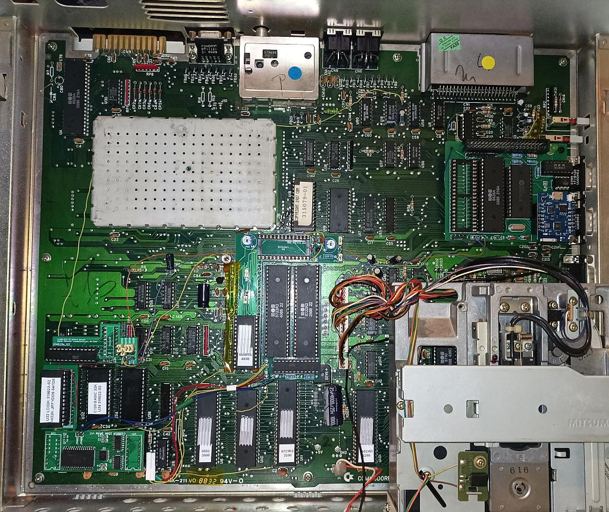
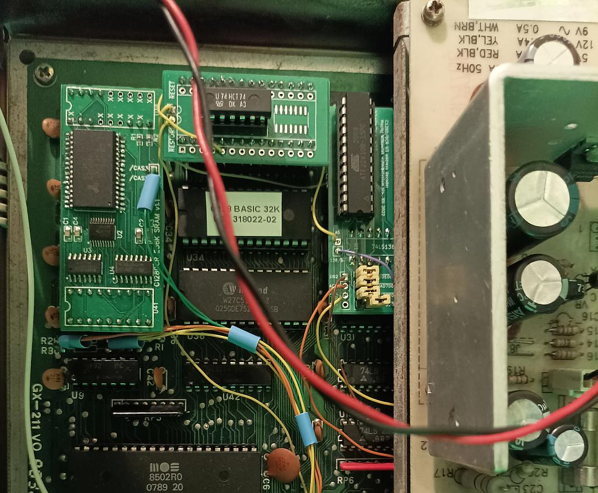
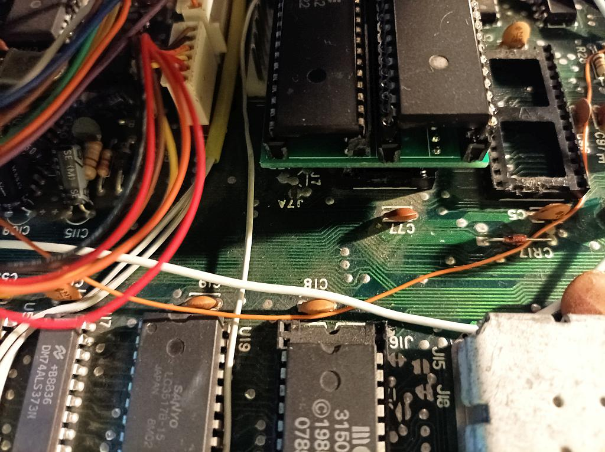

# Advanced I/O space decoder for C128

This is a daughterboard that replaces U3 (74LS138) with a GAL22V10 as the I/O space address decoder providing extra features.

## Background

I needed it to split the I/O ($D000-$DFFF) space into more parts to support additional devices I had installed in my C128DCR: ACIA, SID#2 and CIA#3.

- ACIA for [fast internal WiFi modem](https://github.com/dabonetn/Link232-Wifi) (top right)
- CIA#3 for [CIAIDE IDE interface for a harddisk drive](https://github.com/ytmytm/c64-ciaide) (top right, same daughterboard)
- SID#2 for dual/stereo SID chip tunes (L-shaped daughterboard hugging dual MMU for [256K expansion](https://github.com/ytmytm/c128-mmu-256k-exp))

I wanted to have maximum compatibility with various Dual SID solutions and have the second SID available at least in $D420 and $D500 (in C64 mode) to cover majority of stereo/DualSID tunes.
It's available also optionally at $DE00, as if it was put on a cartridge.

I wanted the GAL to be socketed and the PCB to fit under the power supply.

### Second SID

Note that $D500 is decoded internally in PLA (U11) and the (unconnected) signal from U3 is never active on a stock C128, even in C64 mode. Without changing something
with U3 it's impossible to have second SID at $D500.

There is [another solution to that, focused only on the $D500 problem](https://github.com/hbekel/MixSID/tree/master/firmware/c128) in MixSID project. Simpler to install, but
it doesn't solve the issue of having second SID at $D420.

## Features

This solution provides some extra flexibility:

- SID#1 is active in $D400-$D41F and $D440-$D4FF areas always
- SID#2 signal is active in $D420-$D43F always, in $D500-$D51F in C64 mode and in $DE00-$DE1F if `SID2_DE00` jumper is shorted
- ACIA signal (meant for 6551 serial port) is active in $D700-$D7FF only if `ACIA_D700` jumper is shorted
- if `CIA3_DC20` jumper is shorted then CIA#1 is active in $DC00-$DC1F and $DC40-$DCFF areas
- if `CIA3_DC20` jumper is shorted then CIA#3 signal is active in $DC20-$DC3F
- if `CIA4_DC20` jumper is shorted then CIA#2 is active in $DD00-$DD1F and $DD40-$DDFF areas
- if `CIA4_DC20` jumper is shorted then CIA#4 signal is active in $DD20-$DD3F

## Design

### Schematic

There is not much to see on the [schematic](media/c128-u3-gal.pdf). The circuit is meant to replace the onboard U3 (74LS138) with a GAL22V10. Jumpers short certain signals to the ground
and enable additional functions.

[kicad](kicad/) folder contains all the KiCad 6.0 project files.

### GAL

[gal-jed](gal-jed) folder contains GAL logic prepared in WinCUPL

- JED file to be flashed into GAL
- PLD, DOC files with logic equations
- SI file with simulation cases for complete testing

### Flashing GALs

Flash the [JED](gal-jed/C128-U3.jed) file into a GAL22V10. These devices are themselves obsolete. Chips that I had from an unknown Chinese source were clearly refurbished. ATMEL markings started to rub off even without using alcohol.

I have used TL866 II Plus to flash them. Remember to turn off "Encrypt chip" and "Lock bit" options.

### PCB

[kicad/plots](kicad/plots) folder contains Gerber files for manufacturing a **PCB that will fit C128DCR and not collide with the power supply**. It will **not** fit properly into C128D.

## Installation

### Step 1

Start by removing U3 from the mainboard. Replace it with a socket. Put a 74LS138 back into the socket and check if everything works.

### Step 2

Prepare the PCB. Make sure to solder round pin headers into 74LS138 footprint. You can save square pin headers for jumpers. Install socket for GAL and put a flashed GAL22V10 there.

### Step 3

Remove 74LS138 from U3 socket and replace by the daughterboard. You can check if C128 starts. The keyboard (CIA#1) and disk drive (CIA#2) should work, but there will be no sound (check with CTRL+G in C128 mode).
This is because `A5` is not connected and so pulled high. This makes SID#1 inactive because all accesses are redirected to SID#2.

### Step 4

Connect two required signals:

- `A5` is available on CPU (U6) pin 12, on Z80 pin 35 and on U54 (74LS32) pin 12, but for me the closest place was to take it from any ROM, from pin 5
- `64/128` signal comes from PLA (U11) pin 15 or from MMU (U7) pin 47, but if you don't want to solder to chips it's also available on the mainboard as one of jumper J7 fields, just above U7

### Step 5

Setup jumpers - close (short to GND) to enable features, leave open to keep them disabled.

### Step 6

Connect output signals to your extra circuitry on C128DCR mainboard. In my case these were chip select signals for ACIA (SwiftLink at $D700), CIAIDE (CIA#3) and the second SID.
